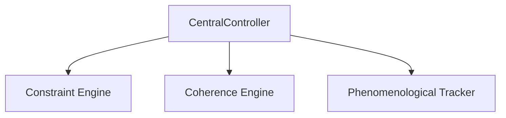
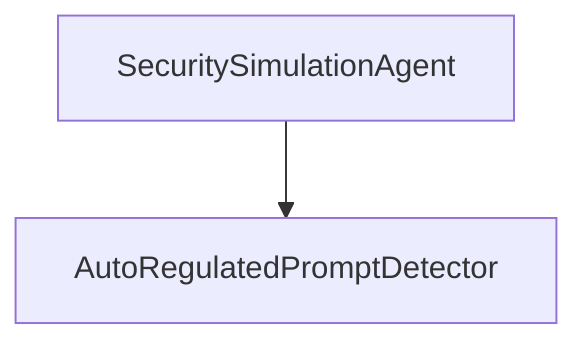

# Constraint-Lattice — Agent Directory

> **Purpose**  Provide a single, friendly entry-point for every *runtime agent* bundled in this monorepo.  
> If you are looking for the low-level manifest that build-tools parse, see [`agents.coz`](agents.coz).  
> This file is for **humans**: architecture sketches, quick-start commands, and contribution guidelines live here.

---

## 1  Agents at a Glance

| Agent      | Path                                 | License              | One-liner                                                                                               |
|------------|--------------------------------------|----------------------|----------------------------------------------------------------------------------------------------------|
| **Varkiel**| `varkiel_agent_main/src/varkiel`     | Lexsight-Proprietary | Tripartite cognitive engine that fuses lattice-theoretic constraints, neural-symbolic coherence and phenomenological tracking. |
| **WildCore**| `wild_core_main/src/wildcore`        | MIT                  | Modular security & anomaly-detection framework simulating malicious prompts (red team) and detecting drifts with an ensemble detector. |

*Table auto-generated from `agents.coz`; run `npm run gen:docs` after adding a new agent to keep it fresh.*

---

## 2  Getting Started

```bash
# clone the repo and set up Python env
git clone https://github.com/ochoaughini/Constraint-Lattice.git
cd Constraint-Lattice
python -m venv .venv && source .venv/bin/activate
pip install -r requirements.txt

# install JS tooling for docs & linting (optional for pure-Python agents)
npm install
```

### 2.1  Running an Agent in Isolation

```bash
# spin up Varkiel’s CLI wrapper
python -m varkiel.cli --help

# run WildCore red-team simulation
python -m wildcore.simulate --scenario basic_escape
```

### 2.2  Executing Unit Tests

```bash
# test only Varkiel
pytest varkiel_agent_main/tests -q

# test only WildCore
pytest wild_core_main/tests -q

# run *all* agent tests
npm run test:agents   # wrapper around tox / pytest-xdist
```

---

## 3  Architecture Diagrams

### Varkiel


### WildCore


---

## 4  Extending the Roster

1. Create your code under `new_agent_main/src/<name>` using a conventional package structure.  
2. Register the agent by appending a new top-level block to [`agents.coz`](agents.coz) with `path`, `license`, `description`.  
3. Add tests in `new_agent_main/tests` and ensure they pass with `pytest -q`.  
4. Run `npm run gen:docs` to refresh this **AGENTS.md**.  
5. Submit a PR; CI will fail if the two files diverge.

---

## 5  FAQ

**Q: Why both `agents.coz` and `AGENTS.md`?**  
• `agents.coz` → parse-friendly for scripts and CI.  
• `AGENTS.md` → onboarding guide for humans.

**Q: Where do I wire an agent into the front-end Dashboard?**  
Expose a REST or WebSocket endpoint in your agent package, then add the route to `Constraint-Lattice-Dashboard/src/services/agentGateway.ts`.

---

© 2025 Lexsight Research / Open-source contributors as noted.
