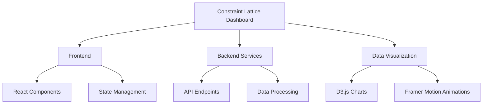

# Constraint Lattice Dashboard

A modern, high-performance dashboard built with React, TypeScript, and Vite, featuring advanced visualization capabilities using D3.js and Framer Motion.

## Features

- Blazing fast development with Vite
- Beautiful, responsive UI with modern design
- Advanced data visualization with D3.js
- Smooth animations with Framer Motion
- Type-safe code with TypeScript
- Comprehensive testing setup
- Code quality with ESLint and Prettier
- Optimized production builds

## Development

### Prerequisites

- Node.js 18+ & npm 8+
- Git

### Getting Started

1. Clone the repository:
   ```bash
   git clone https://github.com/ochoaughini/Constraint-Lattice-Dashboard.git
   cd Constraint-Lattice-Dashboard
   ```

2. Install dependencies:
   ```bash
   npm install
   ```

3. Start the development server:
   ```bash
   npm run dev
   ```
   
   The app will be available at `http://localhost:3001`

### Available Scripts

- `npm run dev` - Start development server
- `npm run build` - Build for production
- `npm run preview` - Preview production build locally
- `npm run lint` - Run ESLint
- `npm run format` - Format code with Prettier
- `npm run type-check` - Check TypeScript types
- `npm run analyze` - Analyze bundle size

## Project Structure



## Contributing

We welcome contributions! Please fork the repository and create a pull request with your changes.

## License

This project is privately licensed to Lexsight LLC. All rights reserved.
